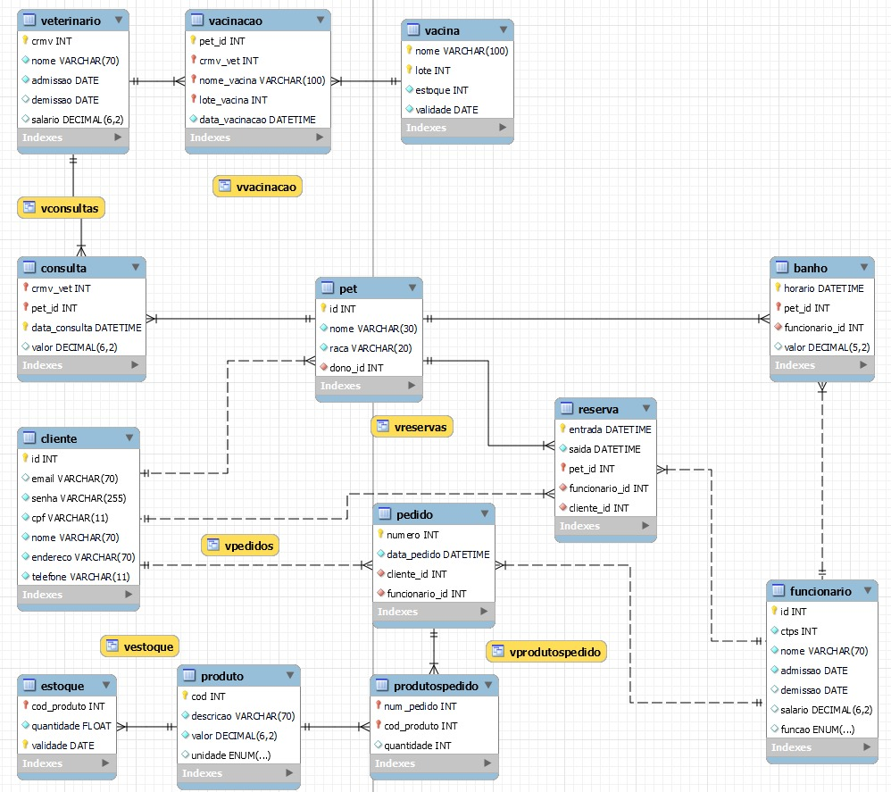

# Bancos de Dados Relacionais - Trabalho

## História

A PetLife, uma clínica veterinária e petshop muito famosa, utiliza um sistema manual de registro de novos pacientes e clientes onde toda informação é registrada em arquivos feitos a mão por um funcionário e armazenada em uma sala de armários lotados de arquivos. A quantidade imensa de registros torna a logística e a consulta aos dados uma tarefa complexa e demorada, atrapalhando a organização e o bom funcionamento do estabelecimento, atrasando filas de espera e causando insatisfação. 

O sistema solicitado permitirá a realização do cadastro dos clientes, assim como o cadastro de seus pets para utilizarem os serviços disponibilizados: reservas no hotel para pets, marcação de horários para banhos, agendamento de consultas veterinárias e vacinações, além da possibilidade de os clientes realizarem pedidos. Os funcionários, que possuem as funções de vendedores, cuidadores, motoristas, banhistas e tosadores, também devem ser cadastrados no sistema para que todas as ações que os envolvem possam ser registradas. 

O estoque, tanto dos produtos para venda quanto das vacinas, deve possuir um controle rígido sobre as datas de validade, não permitindo a entrada de produtos que já estejam vencidos. Por fim, os dados cadastrados deverão ser muito bem controlados, para garantir a segurança dos clientes e seus pets.

## Requisitos funcionais

- Cadastrar clientes 
- Cadastrar pets
- Fazer reservas no hotel para pets
- Agendar horário para banho 
- Agendar consultas para os pets
- Agendar um horário para vacinação dos pets
- Cadastrar produtos
- Fazer pedidos
- Cadastrar os funcionários, separando-os por função (vendedores, cuidadores, motoristas, banhistas e tosadores)
- Controlar estoque

## Entidades e Relacionamentos (EER)

## Visões

- VEstoque: exibe o código, a descrição e o tipo de unidade do produto, e o a quantidade em estoque e sua validade;
- VProdutosPedido: exibe o cliente e o funcionário vinculado a um pedido, e o número do mesmo, e a descrição e quantidade do produto vinculado a um pedido;
- VReservas: exibe o nome do pet, o nome do dono, a data de entrada e saída e o nome do funcionário responsável pela reserva do pet;
- VConsultas: exibe o nome e raça do pet, o nome do dono do pet, o nome do veterinário, a data e o valor da consulta.
- VVacinacao: exibe o nome e raça do pet, o nome do dono do pet, o nome do veterinário, a vacina e o lote utilizados, e a data da aplicação de uma vacina.
- VPedidos: exibe o número do pedido, o nome do cliente, o valor total do pedido, a data do pedido e o vendedor.

## Procedures

As procedures não foram obrigatórias para esse trabalho, sendo desenvolvidas como um estudo à parte do conteúdo ministrado em sala.

- ADDCLIENTE: cadastra um novo cliente, fazendo as validações para email e cpf;
- ADDPET: cadastra um novo pet, verificando se o cliente existe e se o pet já está cadastrado;
- ADDFUNC: cadastra um novo funcionário, verificando se a CTPS já foi cadastrada;
- ADDPEDIDO: registra um novo pedido, verificando se a data é válida e se o funcionário vinculado é um vendedor.
- ADDPROD2PEDIDO: vincula o produto ao pedido caso o pedido exista, e realiza a baixa do estoque do produto.
- ADDPRODUTO: valida a data de validade e cria um produto caso não exista, registrando também seu estoque. caso o produto já exista, apenas o estoque será alterado.
- MKRESERVA: faz uma nova reserva se o funcionário vinculado for um cuidador e se não existir uma reserva cadastrada para o pet no mesmo período.
- MKBANHO: agenda um banho para o pet caso o funcionário seja um banhista, o valor da operação seja maior que 0 e se existirem os registros vinculados à operação (pet, cliente e funcionário).
- MKCONSULTA: agenda uma consulta caso o pet exista, o valor da operação seja maior que 0 e a data informada seja válida.
- ADDVETERINARIO: cria um novo registro para um veterinário, verificando se o valor do salário é maior que 0.
- ADDVACINA: cria um novo registro para uma vacina, verificando se a quantidade e data de validade informada são válidas.
- MKVACINACAO: agenda uma nova vacinação para o pet verificando se os registros vinculados à operação são válidos e se o lote da vacina a ser utilizado está vencido.

## Consultas

1. Seleciona o nome do pet que não tomou nenhuma vacina, e o nome do seu dono;
2. Seleciona o nome do pet que tem uma reserva, uma vacinação e um banho registrados, e o nome do dono do pet;
3. Seleciona a média dos totais dos pedidos.
4. Seleciona o nome do cliente e o total gasto por ele, caso o total gasto tenha sido maior que a média.
5. Seleciona a média de salários dos funcionários que cuidaram de mais de 5 reservas.
6. Seleciona a descrição do produto, a quantidade em estoque e a data de validade de produtos que vencerão nos próximos 2 meses.